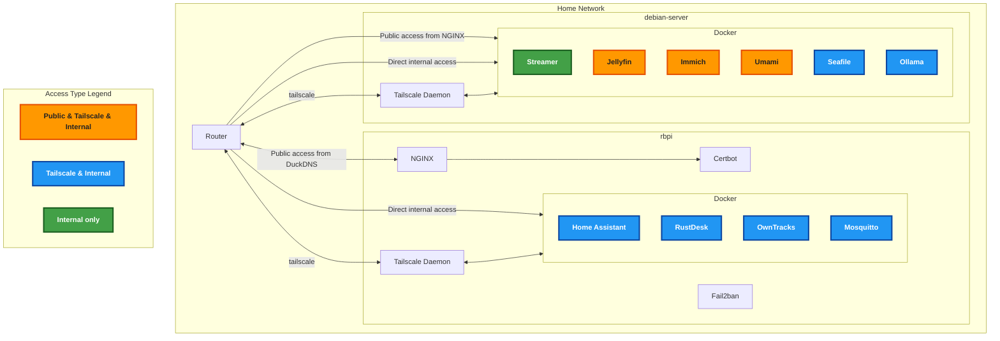

# Home Server Architecture
Multi-node home server infrastructure distributed across debian-server (primary) and rbpi (Raspberry Pi). Uses Docker containerization, NGINX reverse proxy, Tailscale mesh networking, and DuckDNS dynamic DNS.

## System Architecture Diagram

## Service Inventory

| Service            | Host Device     | Access Type                      | Purpose                                               |
| :----------------- | :-------------- | :------------------------------- | :---------------------------------------------------- |
| **Jellyfin**       | `debian-server` | Public (DuckDNS)                 | GPU-accelerated media server                          |
| **Immich**         | `debian-server` | Public (Cloudflare + DuckDNS)¹   | GPU-accelerated photo/video management                |
| **Umami**          | `debian-server` | Public (DuckDNS)                 | Web analytics platform                                |
| **Seafile**        | `debian-server` | Internal/`8585`                  | File sync/backup                                      |
| **Ollama**         | `debian-server` | Internal/`11434`                 | GPU-accelerated LLM inference                         |
| **Streamer**       | `debian-server` | Internal/`9998`                  | GPU-accelerated SRT to RTMP relay to YouTube & Twitch |
| **Certbot**        | `rbpi`          | Internal                         | SSL/TLS certificate management                        |
| **Home Assistant** | `rbpi`          | Internal                         | Home automation                                       |
| **RustDesk**       | `rbpi`          | Internal                         | Remote desktop                                        |
| **OwnTracks**      | `rbpi`          | Internal/`8083`                  | Location tracking                                     |
| **Mosquitto**      | `rbpi`          | Internal                         | MQTT broker for messaging                             |
| **Fail2ban**       | `rbpi`          | Internal                         | SSH/NGINX brute force protection                      |

¹ Immich accessible via Cloudflare (Global Edge Network with media caching) and DuckDNS (direct access for privacy-conscious users)

## Infrastructure

### rbpi
**Hardware**: Raspberry Pi 4B with 4GB RAM

### debian-server

**Hardware**: Intel Core i3-10100 @ 3.60GHz (4 cores, 8 threads), 16GB RAM, NVIDIA GTX 1650 Super (4GB VRAM)
**Storage**: 467GB NVMe SSD + 5TB Seagate external HDD (mounted at /mnt/hdd1)

#### Seafile
Configured with privileged access and SYS_ADMIN capability for FUSE mounting. Custom entrypoint wrapper (`seafile-scripts/entrypoint-wrapper.sh` + `seafile-scripts/start-seaf-fuse.sh`) automatically mounts seaf-fuse at `/seafile-fuse` on container startup. Enables direct file access for services like Immich without API overhead.

#### Ollama
GPU-accelerated LLM inference utilizing 4GB VRAM. Models are sized to fit within GPU memory constraints for optimal performance.
| Model          | Size   | Classification | Use Case                   |
| -------------- | ------ | -------------- | -------------------------- |
| qwen3:1.7b     | 1.4 GB | Speed          | Low-latency inference      |
| qwen3:4b       | 2.6 GB | General        | Balanced performance       |
| gemma3:4b      | 3.3 GB | Multimodal     | Text and vision processing |
| qwen3:latest   | 5.2 GB | Intelligence   | Complex reasoning (CPU fallback) |
| deepseek-r1:8b | 5.2 GB | Intelligence   | Complex reasoning (CPU fallback) |

#### Streamer
GPU-accelerated SRT to RTMP relay service for streaming to YouTube & Twitch. Expects HEVC video and AAC audio input.

### Networking

- **Linksys E8450 AX3200 Router**: Core network device with OpenWRT firmware providing internet connectivity and routing
- **5-Port Gigabit Desktop Switch**: Expands wired connectivity for multiple devices with gigabit speeds
- Each host is connected via wired Ethernet with at least 1Gbps speed

### Network Access Strategy
Every service is accessible via **local network** or **Tailscale mesh VPN** for secure internal communication. Services are made public-facing through **DuckDNS** only when Tailscale access is not feasible. **Cloudflare** is used selectively for services requiring global edge access with caching (e.g., Immich).

## Setup and Maintenance Instructions

### Accessing Internal Services via Tailscale
Many services (Seafile, Ollama, Streamer, Home Assistant, RustDesk, OwnTracks, Mosquitto) are only accessible within your Tailscale network.

1. Install Tailscale on your client device (laptop, phone, etc.) and authenticate to your network.
2. Find the Tailscale IP address of the target host (e.g., debian-server or rbpi) using `tailscale status`.
3. Access internal services using the Tailscale IP and service port. Example:
   - Seafile: `http://<tailscale-ip>:8585`
   - Ollama: `http://<tailscale-ip>:11434`
   - Streamer: SRT input to `<tailscale-ip>:<udp-port>`
   - Home Assistant: `http://<tailscale-ip>:8123`
   - Mosquitto: MQTT broker at `<tailscale-ip>:1883`
4. For SSH or admin access, connect directly to the Tailscale IP.

### Initial Setup
1. Clone the repository and review the `compose.yaml` and `rbpi/docker-compose.yaml` files for service configuration.
2. Install Docker and Docker Compose on both debian-server and rbpi.
3. Set up Tailscale on all devices for secure mesh networking. See [Tailscale docs](https://tailscale.com/kb/).
4. Configure NGINX reverse proxy using provided configs. Add recommended security headers.
5. Install Certbot and obtain SSL certificates for public-facing services. Example: `certbot --nginx -d example1.duckdns.org -d example2.duckdns.org`.
6. Update all `.env` files and secrets with strong passwords.
7. Deploy containers using `docker compose up -d` on each host.
8. Set up UFW or iptables to restrict access to only necessary ports.

### Maintenance
- Renew SSL certificates regularly: `certbot renew`
- Update Docker images and restart containers as needed: `docker compose pull && docker compose up -d`
- Monitor logs for errors and security events
- Periodically review and update firewall rules and NGINX configs
- Backup important data and configs
